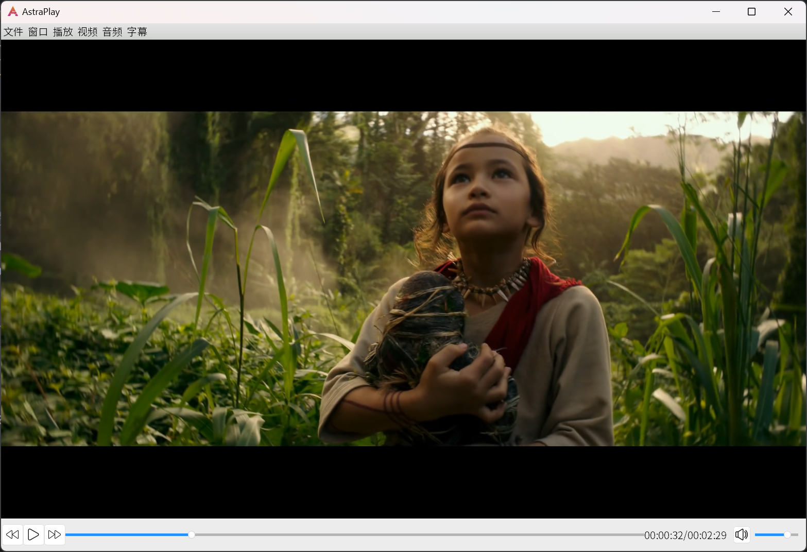

# AstraPlay

# 一、基本功能概述

AstraPlay是一款基于libmpv和Qt5框架，使用C++语言编写的功能强大的视频播放器。

以下是其主要功能概述：

1. **简便打开文件播放**：AstraPlay支持用户轻松打开各种视频文件格式，提供流畅的播放体验。

   `视频文件 (*.mpg *.mpeg *.avi *.mp4 *.mkv *.webm *.wmv *.mov *.flv *.m4v *.ogv *.3gp *.3g2)`

   `音频文件 (*.mp3 *.aac *.ogg *.flac *.alac *.wav *.wv)`

   `流媒体 (*.m3u8 rtmp协议)`

2. **精密音量控制**：随心调整音量，确保声音在任何环境下都能达到最佳效果。
3. **全屏播放体验**：AstraPlay提供全屏播放选项，让用户沉浸于高质量的视听享受中。
4. **进度条拖动**：用户可以通过直观的进度条拖动功能，精准掌握视频播放进度，随时定位到感兴趣的场景。
5. **音视频同步调整**：提供声音提前和延后的调整功能，以满足用户对音视频同步性的个性化需求。
6. **变速功能**：用户可以通过JKL键调整播放速度，为视频观看提供更多可能性。用户也可以使用菜单栏中的选项，以0.5倍的间隔微调播放速率。
7. **字幕加载与样式调整**：AstraPlay支持字幕加载和样式调整，确保用户能够在观看时获得最佳的字幕体验。
8. **字幕列表选择**：AstraPlay可以读取视频内置、外置加载的字幕列表，便于用户随时选择合适的字幕进行观看。
9. **视频截图功能**：利用设定数量平分时间轴，AstraPlay能够智能截取视频预览图，方便用户快速预览整个视频。
10. **错误信息显示**：AstraPlay能够及时显示错误信息，让用户了解并解决任何可能的播放问题。
11. **在线视频播放与下载**：借助yt-dlp，AstraPlay支持在线视频的直接播放和下载，为用户提供更多选择。
12. **元数据读取与显示**：利用MediaInfo，AstraPlay实现了对视频元数据的读取和显示，让用户了解更多关于视频文件的信息。
13. **最近打开文件记录**：AstraPlay可以记录最近打开的5个文件或URL，便于用户观看常看视频。
14. **逐帧跳转**：用户可以使用菜单栏中的选项或快捷键，逐帧的查看视频，适用于定位特定帧的情形。
15. **画面缩放与移动**：用户可以使用菜单栏中的选项或快捷键，对视频画面进行缩放与位移。

# 二、模块设计

- 播放控制模块
    - 初始化MPV实例，与playerWidget绑定
    - 正常打开文件、URL播放
    - 暂停、播放视频
    - 进度条初始化、更新
    - 跳转到指定时间位置播放
    - 视频画面缩放、位置控制
    - 音量调整、静音
    - 播放速率控制
    - 音视频同步
    - 逐帧跳转
    - 全屏播放
- 元数据读取模块
    - 调用MediaInfo，读取当前播放视频的元数据
    - 显示读取到的元数据
- 截图模块
    - 截取当前帧并保存
    - 用户设定截图数量，平分时间轴，截取多张预览图保存
- 字幕控制模块
    - 加载外挂字幕`（*.srt *.ass *.ssa *.sub）`
    - 调整字幕样式（对SRT类型字幕生效）
    - 显示字幕列表
    - 控制字幕同步
- 视频下载模块
    - 调用yt-dlp对视频进行解析下载
    - 处理下载过程中的错误并弹出对应错误信息
    - 与进程信息输出模块连接，输出运行状态信息
- 进程信息输出模块
    - 输出进程运行中的各种信息
    - 分别提取出普通提示信息与错误信息

# 三、图形界面设计



主体部分采用Qt Creator开发，其余的弹出窗口使用代码实现。

整体的风格样式通过加载第三方QSS样式表实现。

# 四、开发环境

**集成开发环境 (IDE):** CLion 2023.2.2

**主要编程语言:** C++

**图形用户界面 (GUI)库:** Qt 5.15.2

**多媒体库:** libmpv x86_64-v3-20240121

**开发平台:** Windows 11

**依赖管理工具:** 使用CMake构建系统进行项目管理

**构建工具:** CMake 3.26.4

**版本控制系统:** Git version 2.41.0.windows.1

**网页视频下载:** yt-dlp 2023.12.30

**视频元数据读取:** MediaInfo 23.11.1

# 五、开发流程

## （一）程序目录结构

1. `include`

   用来存放头文件（`.h` 或 `.hpp` 文件）。将头文件放在单独的`include`目录中可以方便其他项目或文件包含这些声明，同时也有助于分离声明和实现，使得项目更加清晰。

2. `libs`

   `libs`目录用于存放项目依赖的静态或动态链接库文件（`.lib`、`.a`、`.dll`、`.so` 等）。把库文件放在一个统一的地方简化链接过程。

3. `resources`

   这个文件夹包含了程序运行时需要的资源文件，如图像、音频、配置文件、UI布局文件等。这些资源通常在程序运行时被加载，而不是编译到可执行文件中。

4. `src`

   `src`目录包含了项目的源代码文件（`.c`、`.cpp`、`.java` 等）。这是项目的核心部分，包含了大部分的逻辑和功能实现。

5. `third`

   `third`目录包含了项目使用到的第三方插件（`yt-dlp`、`MediaInfo`），供主程序调用。

## （二）程序文件结构

```bash
│  .gitattributes
│  .gitignore
│  CMakeLists.txt
│  CMakeLists.txt.user
│  LICENSE
│  README.md
│
├─include
│  │  application.h
│  │  controller.h
│  │  media_info.h
│  │  output_window.h
│  │  screen_capture.h
│  │  subtitle.h
│  │  video_downloader.h
│  │
│  └─mpv
│          client.h
│          qthelper.hpp
│          render.h
│          render_gl.h
│          stream_cb.h
│
├─libs
│  └─mpv
│          libmpv-2.dll
│          libmpv.dll.a
│
├─resources
│  │  application.ui
│  │  Aqua.qss
│  │  resources.qrc
│  │
│  └─icons
│
├─src
│  │  application.cpp
│  │  controller.cpp
│  │  main.cpp
│  │
│  └─func
│          media_info.cpp
│          output_window.cpp
│          screen_capture.cpp
│          subtitle.cpp
│          video_downloader.cpp
│
└─third
    │  yt-dlp.exe
    │
    └─MediaInfo
           LIBCURL.DLL
           MediaInfo.exe
```

# 六、所遇难点

1. 由于Qt5 Slider类的限制，需要重写类对于鼠标点击定位部分代码，无法直接实现鼠标点击进度条某位置即跳转的功能。
2. 由于mpv自身并未针对向后播放进行开发，调用libmpv实现向后播放在实践调试后依然无法实现可用性，最后舍弃该功能。
   以下是mpv官方对向后播放功能的部分说明：

   > Backward decoding. The decoder library used (libavcodec) does not support this. It is emulated by feeding bits of
   data in forward, putting the result in a queue, returning the queue data to the VO in reverse, and then starting over
   at an earlier position. This can require buffering an extreme amount of decoded data, and also completely breaks
   pipelining.**→libmpv的编解码库并不支持向后解码，以模拟的方式进行馈送数据破坏数据管线**

   > It's fragile. If anything doesn't work, random non-useful behavior may occur. In simple cases, the player will just
   play nonsense and artifacts. In other cases, it may get stuck or heat the CPU. (Exceeding memory usage significantly
   beyond the user-set limits would be a bug, though.)**→在测试中大部分视频无法向后播放**

   > Some container formats, audio, and video codecs are not supported due to their behavior. There is no list, and the
   player usually does not detect them. Certain live streams (including TV captures) may exhibit problems in particular,
   as well as some lossy audio codecs. h264 intra-refresh is known not to work due to problems with libavcodec. WAV and
   some other raw audio formats tend to have problems - there are hacks for dealing with them, which may or may not
   work.**→H.264编码的视频在测试中全部失败**
3. 拖动进度条显示缩略图的功能涉及第二个MPV实例对视频不同时间点的播放，且小缩略图跟随鼠标移动的实现较为困难，多次测试后遇到的问题较多，最终放弃该功能的开发。

# 七、测试流程

1. 打开本地视频，对每个所写功能逐个测试，找出存在的问题并通过断点调试等方法逐个解决。
2. 在线视频及流媒体测试部分网址如下表：

| 名称                              | 地址（以下地址在2024.1.29测试均通过）                                                                    |
|---------------------------------|--------------------------------------------------------------------------------------------|
| 1080P 60fps                     | https://sdk-release.qnsdk.com/1080_60_5390.mp4                                             |
| 2K 25fps                        | https://sdk-release.qnsdk.com/2K_25_11700.mp4                                              |
| 2K 60fps                        | https://sdk-release.qnsdk.com/2K_60_6040.mp4                                               |
| 4K 25fps                        | https://sdk-release.qnsdk.com/4K_25_21514.mp4                                              |
| 带有端口号的视频                        | https://img.qunliao.info:443/4oEGX68t_9505974551.mp4                                       |
| H.265视频                         | http://demo-videos.qnsdk.com/bbk-H265-50fps.mp4                                            |
| 带有封面的MP3音频流                     | https://sdk-release.qnsdk.com/1599039859854_9242359.mp3                                    |
| FLV格式视频                         | https://sdk-release.qnsdk.com/flv.flv                                                      |
| BipPop Basic 640x480 @ 650 kbps | http://devimages.apple.com.edgekey.net/streaming/examples/bipbop_4x3/gear2/prog_index.m3u8 |
| 漳浦综合 HD                         | http://220.161.87.62:8800/hls/0/index.m3u8                                                 |
| RTMP测试                          | rtmp://ns8.indexforce.com/home/mystream                                                    |

# 八、程序手册
### [点击下载程序手册](https://raw.githubusercontent.com/maokeduolai/AstraPlay/master/AstraPlayManual.chm)